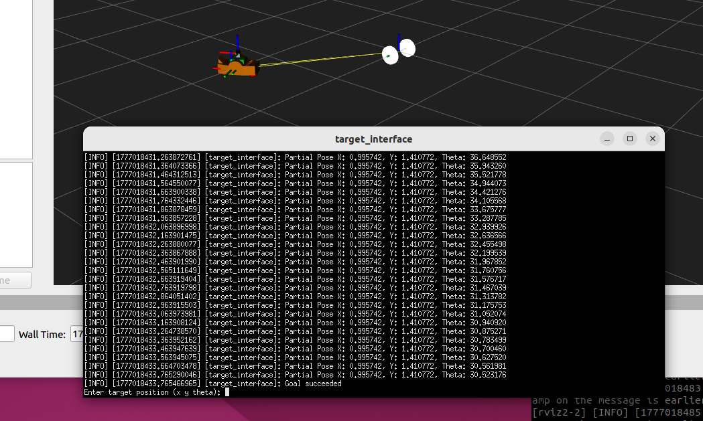

# Assignment1_rt2

A ROS 2 package implementing an **action-based target navigation system** for a mobile robot. The robot receives a target pose from a user interface, navigates toward it using TF2 transforms, and reports back feedback and results through an action server/client architecture.

---


## Dependencies

This package requires the following additional repositories to be cloned alongside it:

| Repository | Branch | Description |
|------------|--------|-------------|
| [CarmineD8/bme_gazebo_sensors](https://github.com/CarmineD8/bme_gazebo_sensors) | `rt2` | Gazebo simulation environment and robot sensors |
| [antozerba/custom_interface](https://github.com/antozerba/custom_interface) | `main` | Custom ROS 2 messages, services and actions |

---

## Installation

```bash
cd ~/ros2_ws/src

# Clone the main package
git clone https://github.com/antozerba/assignment1_rt2.git

# Clone the simulation environment (rt2 branch)
git clone -b rt2 https://github.com/CarmineD8/bme_gazebo_sensors.git

# Clone the custom interfaces
git clone https://github.com/antozerba/custom_interface.git

# Build all packages
cd ~/ros2_ws
colcon build

# Source the workspace
source install/setup.bash
```

---

## Package Structure

```
assignment1_rt2/
├── launch/
│   └── ass1_rt2.launch.py    # Main launch file
├── src/
│   ├── controller.cpp         # Action server + navigation logic (component)
│   └── ui_node.cpp            # User interface + action client
├── CMakeLists.txt
└── package.xml
```

---

## Nodes

### `target_interface` (ui_node.cpp)

Interactive node that:
1. Prompts the user to enter a target pose `(x, y, theta)` via stdin.
2. Broadcasts the target as a **static TF transform** (`base_link` → `target`).
3. Connects to the `target` action server and sends the goal.
4. Logs feedback (partial pose) and the final result.

| Resource | Type | Description |
|----------|------|-------------|
| `/tf_static` | `tf2_msgs/TFMessage` | Publishes the target frame |
| `target` (action client) | `custom_interface/action/Target` | Sends the navigation goal |

---

### `controller` (controller.cpp — component)

Action server node that:
1. Accepts navigation goals from `target_interface`.
2. Uses TF2 to track the robot's current pose relative to the target.
3. Publishes velocity commands to drive the robot.
4. Sends pose feedback during execution and the final result on completion.

| Resource | Type | Description |
|----------|------|-------------|
| `/cmd_vel` | `geometry_msgs/msg/Twist` | Publishes velocity commands |
| `target` (action server) | `custom_interface/action/Target` | Receives and executes navigation goals |

---

## Run

Everything can be launched with a single command:

```bash
ros2 launch assignment1_rt2 ass1_rt2.launch.py
```

Once running, the UI node will prompt:

```
Enter target position (x y theta): 2.0 1.5 30
```

---


## Components

### 1. UI Node — `src/ui_node.cpp` → executable `target_interface`

**Action client** node that handles user interaction and goal sending.

**Methods:**

| Method | Description |
|---|---|
| `get_input()` | Reads target coordinates `x y theta` from stdin |
| `make_target()` | Broadcasts the static TF2 transform `base_link → target` |
| `send_goal()` | Sends the goal to the action server and registers callbacks |
| `goal_response_callback()` | Logs whether the goal was accepted or rejected |
| `feedback_callback()` | Logs the partial pose received during execution |
| `result_callback()` | Logs the final pose and handles abort/cancel cases |

**Execution flow:**

```
Node startup
    │
    ▼
get_input()          ← reads x, y, theta from stdin
    │
    ▼
make_target()        ← broadcasts static TF: base_link → target
    │
    ▼
Timer (500ms)        ← waits for the system to be ready
    │
    ▼
send_goal()          ← sends goal to the action server
    │
    ├── feedback_callback()   ← periodic pose updates
    └── result_callback()     ← final result
```

---

### 2. Controller Node — `src/controller.cpp` → component `controller_component`

**Action server** node loaded as a ROS2 component. Handles execution of the movement toward the target.

**Infrastructure:**

| Element | Type | Purpose |
|---|---|---|
| `action_server` | `rclcpp_action::Server<Target>` | custom action server |
| `tf_buffer` + `tf_listener` | TF2 | Reads the robot's current transform |
| `vel_pub` | `Publisher<Twist>` on `/cmd_vel` | Publishes velocity commands |

**Server callbacks:**

| Callback | Behavior |
|---|---|
| `handle_goal()` | Always accepts the goal and logs the received coordinates |
| `handle_cancel()` | Always accepts cancellation requests |
| `handle_accepted()` | Spawns a detached thread that runs `execute()` |
| `execute()` | Double phase controller over distance and yaw errror


## ROS 2 Dependencies

- `rclcpp`
- `rclcpp_action`
- `rclcpp_components`
- `tf2` / `tf2_ros`
- `geometry_msgs`
- `rosidl_default_generators` / `rosidl_default_runtime`

---

## Author

**Anto** — [antozerba28@gmail.com](mailto:antozerba28@gmail.com)